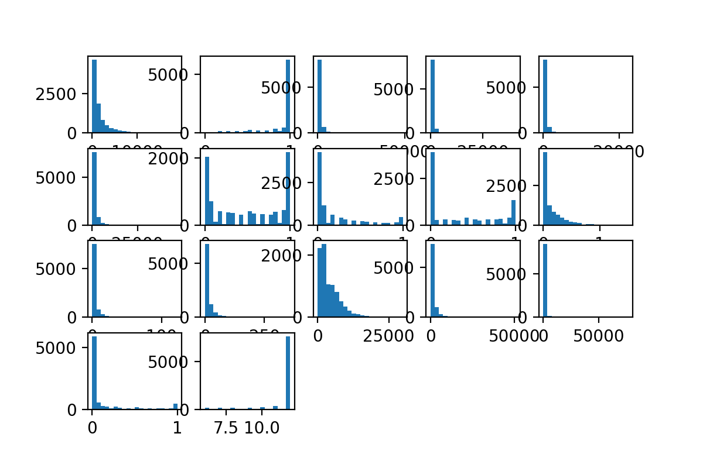
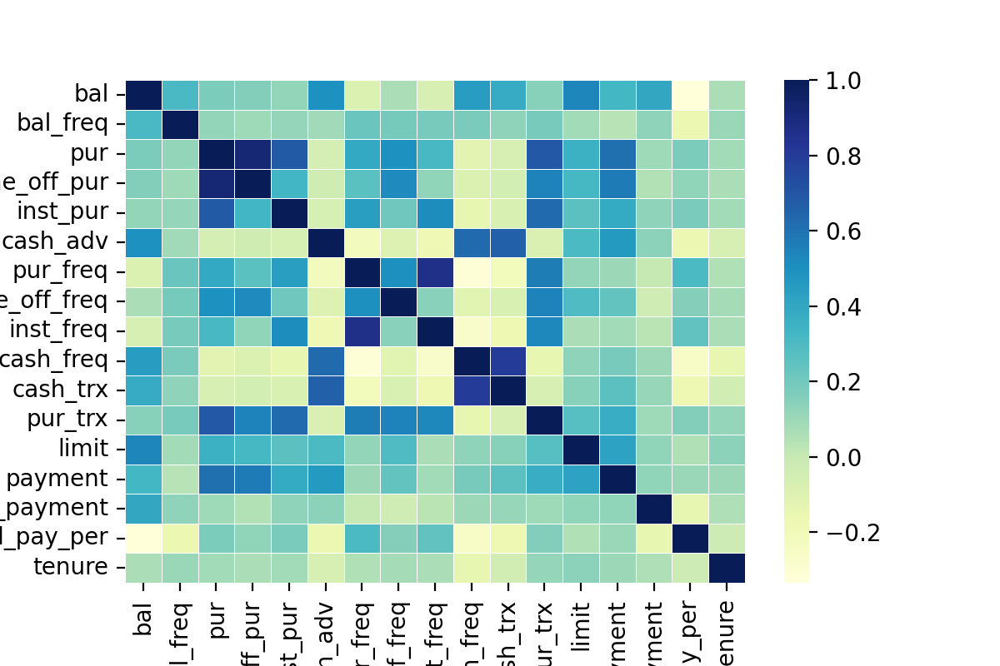
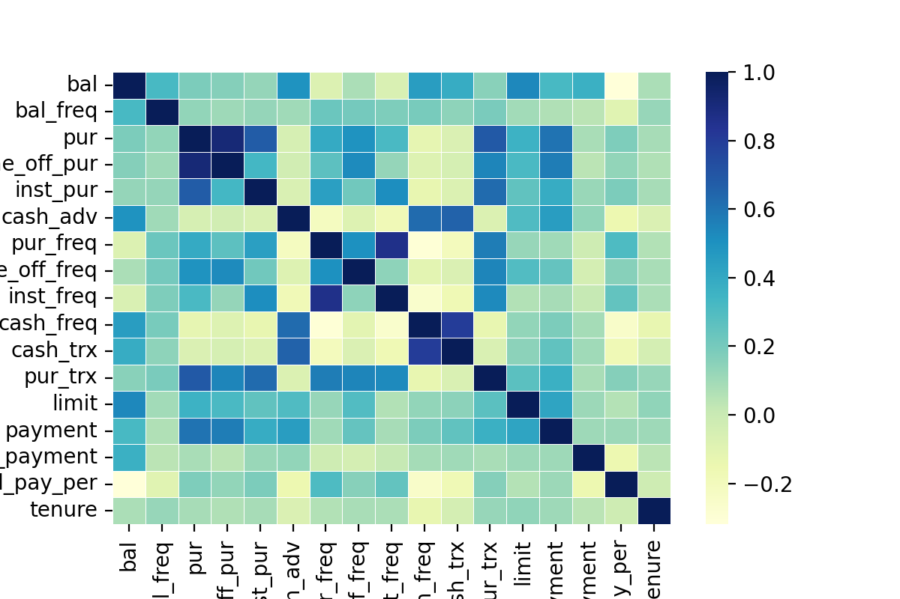

###数据分析

总数据量8590，含有NaN的数据314，其中313条数据的NaN在minimum payments属性，1条数据的NaN在credit limit属性。

各属性数值分布如下：

删去含有NaN的数据，并做标准化，计算结果的协方差矩阵，得到热力图如下：

对credit limit属性的一个缺失值，用其余数据的平均值填补

对minimum payments属性的缺失值，先选择与这个属性段相关系数最大的8个属性，通过PCA降到4维，
再对有缺失值的数据取其5个最近邻的该字段平均值填补该字段。

填补完成后的数据做标准化，协方差矩阵的热力图如下：

